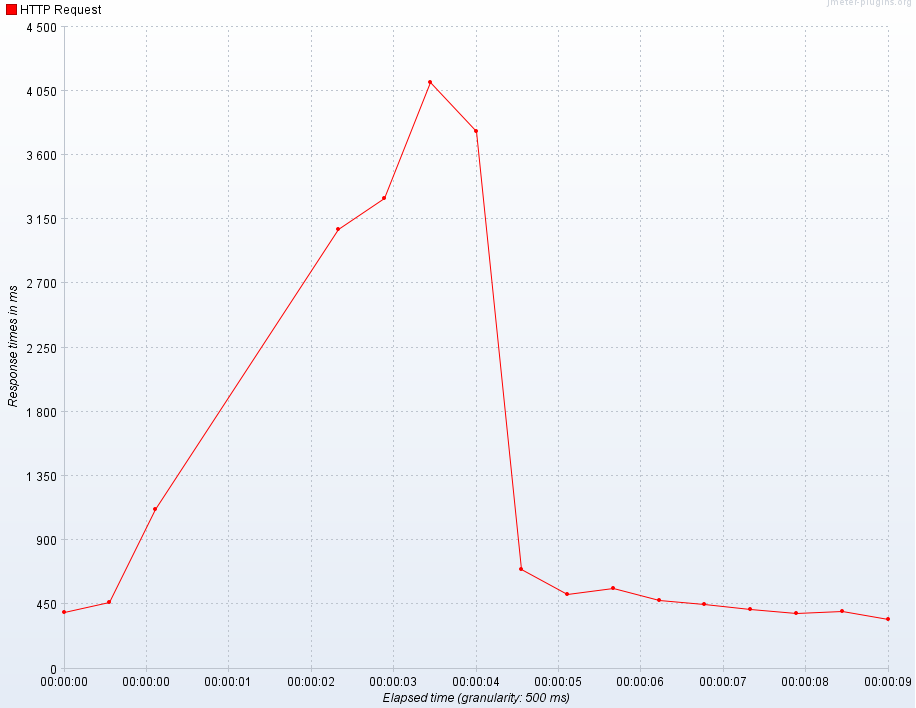
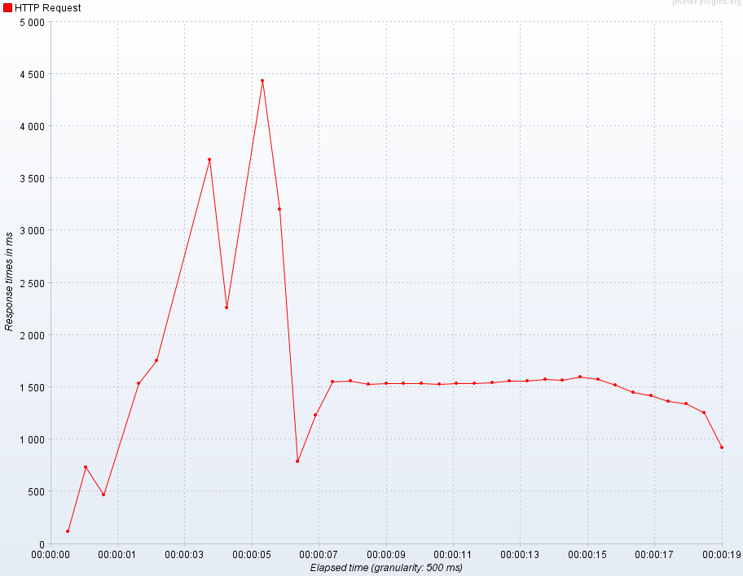
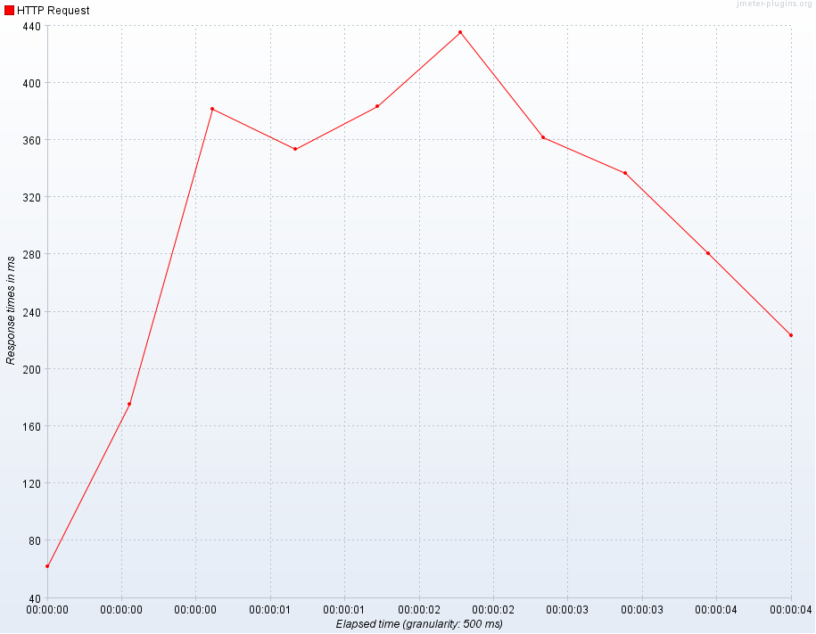

# Account management service.

## How it run.

Run with **node**:
```
cd ./node
docker-compose up
```

Run with **Spring/Tomcat**:
```
cd ./tomcat
docker-compose up
```

Run with **Spring/Netty**:
```
cd ./netty
docker-compose up
```

## Project database schema.


## REST API

* POST /api/auth-management/authentication
```
{
    "accessToken": "{{token}}"
}
```

* POST /api/user-management/login
```
{
    "name": "uname",
    "password": "upass"
}
```

* POST /api/user-management/registration
```
{
    "name": "uname",
    "password": "upass",
    "project": [
        "UserDomainApi"
    ]
}
```

* POST /api/user-management/validate-username
```
{
    "name": "uname"
}
```

## Atomic run for testing

## Сreation of a common network

```
docker network create --driver=bridge commonet
```

## Building images

Run the following commands from the **root folder**:

```
cd ./node
docker build -t node-app .
cd ../

cd ./tomcat
docker build -t tomcat-app .
cd ../

cd ./netty
docker build -t netty-app .
cd ../
```

## Run container with database

```
docker run \
-p 5432:5432 \
-e POSTGRES_DB='user-domain-api' \
-e POSTGRES_USER='postgres' \
-e POSTGRES_PASSWORD='strong-password' \
-v $(pwd)/db/initdb:/docker-entrypoint-initdb.d \
-v $(pwd)/db/postgres-data:/var/lib/postgresql/data \
--net=commonet \
--name=postgres \
--cpuset-cpus='0,1,2' \
--memory='2048m' \
postgres:alpine
```

## Run container with pgadmin

```
docker run \
-p 5050:80 \
-e PGADMIN_DEFAULT_EMAIL='postgres@pgadmin.com' \
-e PGADMIN_DEFAULT_PASSWORD='root' \
--net=commonet \
--name=pgadmin \
dpage/pgadmin4
```

## Run container with node-app

```
docker run \
-p 5000:5000 \
-e PORT='5000' \
-e DB_HOST='postgres' \
-e DB_PORT='5432' \
-e DB_USER='postgres' \
-e DB_PASSWORD='strong-password' \
-e DB_NAME='user-domain-api' \
--net=commonet \
--name=node-app \
--cpuset-cpus='3' \
--memory='1024m' \
node-app:latest
```

## Run container with tomcat-app

```
docker run \
-p 5000:5000 \
--net=commonet \
--name=tomcat-app \
--cpuset-cpus='3' \
--memory='1024m' \
tomcat-app:latest
```

# Load testing results

## Node

### NODE / POST /api/user-management/registration

## Test 1

Number of Threads (users): 100

Seconds: 1

Loop count: 10


## Test 2

Number of Threads (users): 300

Seconds: 1

Loop count: 10


## Test 3

Number of Threads (users): 500

Seconds: 1

Loop count: 10


## Test 4

Number of Threads (users): 1000

Seconds: 1

Loop count: 10


### NODE / POST /api/user-management/validate-username

## Test 1

Number of Threads (users): 100

Seconds: 1

Loop count: 10


## Test 2

Number of Threads (users): 300

Seconds: 1

Loop count: 10


## Test 3

Number of Threads (users): 500

Seconds: 1

Loop count: 10




## Test 4

Number of Threads (users): 1000

Seconds: 1

Loop count: 10


### NODE / POST /api/user-management/login

## Test 1

Number of Threads (users): 100

Seconds: 1

Loop count: 10




## Test 2

Number of Threads (users): 300

Seconds: 1

Loop count: 10


## Test 3

Number of Threads (users): 500

Seconds: 1

Loop count: 10


## Test 4

Number of Threads (users): 1000

Seconds: 1

Loop count: 10


### NODE / POST /api/auth-management/authentication

## Test 1

Number of Threads (users): 100

Seconds: 1

Loop count: 10


## Test 2

Number of Threads (users): 300

Seconds: 1

Loop count: 10


## Test 3

Number of Threads (users): 500

Seconds: 1

Loop count: 10


## Test 4

Number of Threads (users): 1000

Seconds: 1

Loop count: 10


## tomcat

### TOMCAT / POST /api/user-management/registration

## Test 1

Number of Threads (users): 100

Seconds: 1

Loop count: 10


## Test 2

Number of Threads (users): 300

Seconds: 1

Loop count: 10


## Test 3

Number of Threads (users): 500

Seconds: 1

Loop count: 10


## Test 4

Number of Threads (users): 1000

Seconds: 1

Loop count: 10


### TOMCAT / POST /api/user-management/validate-username

## Test 1

Number of Threads (users): 100

Seconds: 1

Loop count: 10


## Test 2

Number of Threads (users): 300

Seconds: 1

Loop count: 10


## Test 3

Number of Threads (users): 500

Seconds: 1

Loop count: 10


## Test 4

Number of Threads (users): 1000

Seconds: 1

Loop count: 10


### TOMCAT / POST /api/user-management/login

## Test 1

Number of Threads (users): 100

Seconds: 1

Loop count: 10


## Test 2

Number of Threads (users): 300

Seconds: 1

Loop count: 10


## Test 3

Number of Threads (users): 500

Seconds: 1

Loop count: 10


## Test 4

Number of Threads (users): 1000

Seconds: 1

Loop count: 10


### TOMCAT / POST /api/auth-management/authentication

## Test 1

Number of Threads (users): 100

Seconds: 1

Loop count: 10


## Test 2

Number of Threads (users): 300

Seconds: 1

Loop count: 10




## Test 3

Number of Threads (users): 500

Seconds: 1

Loop count: 10


## Test 4

Number of Threads (users): 1000

Seconds: 1

Loop count: 10


